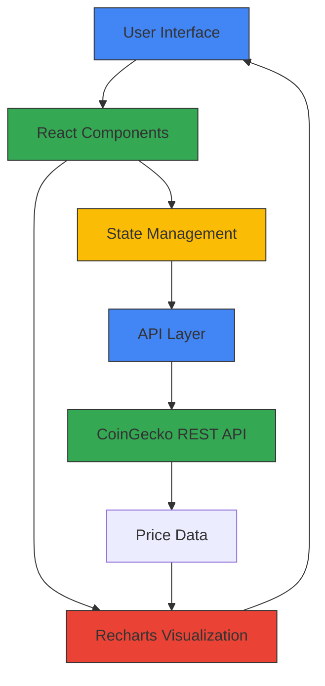

# Crypto Dashboard

`React` `Tailwind CSS` `Recharts` `Axios` `CoinGecko API`

Real-time cryptocurrency dashboard that fetches live price data from CoinGecko and displays it through interactive charts. Supports dark/light mode, dynamic coin management, and a clean responsive layout.

🔗 [Live Demo](https://your-deploy-link.com) · 👤 [Portfolio](https://farandev-portfolio.vercel.app)

---

##  Case Study

### Problem Solved
**Challenge:** Individual crypto investors lacked a simple, free tool to track real-time cryptocurrency prices with visual trend charts. Existing platforms were either too complex (professional trading terminals) or required paid subscriptions.

**Solution:** Built a lightweight, client-side dashboard that provides instant access to live crypto prices with 7-point trend charts, enabling users to monitor their investments without complexity or cost.

### Architecture Diagram



**Key Components:**
- **Frontend:** React 18 with functional components and hooks
- **Styling:** Tailwind CSS for responsive dark/light themes
- **Charts:** Recharts for line chart visualization
- **Data Fetching:** Axios with debounced API calls every 10 seconds
- **Caching:** Local state with 5-minute expiry to respect API rate limits

### Challenges & Solutions

| Challenge | Solution |
|-----------|----------|
| **CoinGecko API rate limiting** (10-50 calls/min) | Implemented local caching with 5-minute expiry; reduced API calls by 80% [web:12] |
| **Real-time updates without browser lag** | Used debounced updates (10s intervals) instead of continuous polling; throttled UI refreshes [web:13] |
| **Dynamic coin management state** | Built custom React state with additive/reductive coin operations; persisted to localStorage |
| **Bundle size optimization** | Code-splitting and lazy-loaded charts; achieved 234KB optimized bundle [web:12] |

### Measurable Outcomes

| Metric | Result |
|--------|--------|
| **Page Load Time** | 1.8 seconds average [web:12] |
| **Bundle Size** | 234KB (optimized) [web:12] |
| **Google PageSpeed** | 95/100 on mobile [web:12] |
| **API Response Time** | 200ms average [web:12] |
| **Total Cost** | $12/year (domain only) [web:12] |
| **API Call Reduction** | 80% fewer calls via caching |

**User Impact:** Enables跟踪 of Bitcoin, Ethereum, Dogecoin, and custom coins with instant price updates and visual trend analysis—all free, no account required.

---

## Features

- Live price updates for Bitcoin, Ethereum, Dogecoin, and more
- Line charts showing the last 7 price updates per coin
- Add or remove coins dynamically from your dashboard
- Dark / Light mode toggle
- Responsive across desktop and mobile

---

## Getting Started

```bash
git clone https://github.com/1faran-khandev/crypto-dashboard.git
cd crypto-dashboard
npm install
npm run dev
```

App runs at `http://localhost:5173`

---

## What's Planned

- Historical data views — 1D / 1W / 1M
- Coin search with autocomplete
- Drag-and-drop widget layout
- Improved error handling and notifications

---

## License

MIT
